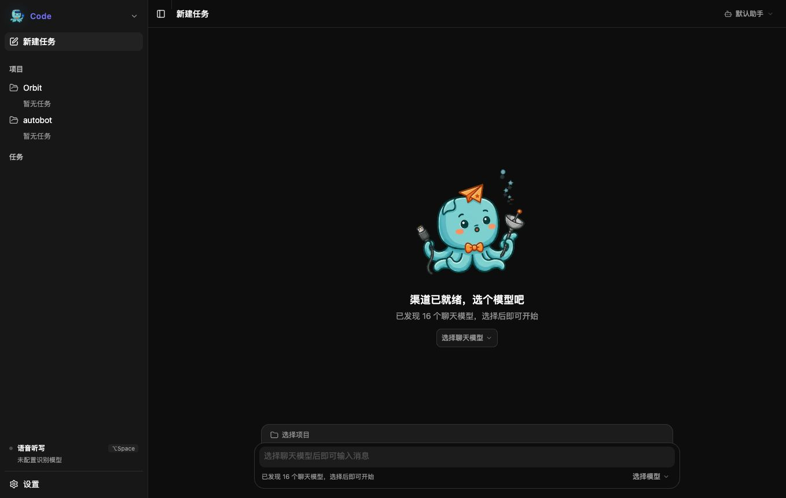

<div align="center">


# Tietiezhi · 铁铁汁

**连接每一个设备与每一个 AI 模型。**

让 macOS、Windows、Linux、iOS、Android、服务端与边缘节点，在同一个开放 Agent 网络中协作。

[简体中文](./README.md) · [English](./README.en.md) · [日本語](./README.ja.md) · [한국어](./README.ko.md)

[⬇️ 下载 macOS / Windows](https://tietiezhi-1216.github.io/tietiezhi/) · [📦 最新版本](https://github.com/tietiezhi-1216/tietiezhi/releases/latest) · [🗺️ 路线图](./docs/ROADMAP.md) · [🔒 隐私政策](./docs/PRIVACY.md) · [💬 问题反馈](https://github.com/tietiezhi-1216/tietiezhi/issues) · [⚖️ Apache-2.0](./LICENSE)

</div>

<div align="center">



<sub>渠道连接完成后，由用户为新任务选择合适的模型</sub>

</div>

## Tietiezhi 是什么？

Tietiezhi（铁铁汁）是一个以 **设备 × 模型互联**为核心的开源 AI 项目。它不假设所有工作都应该挤在一台电脑、一个聊天窗口或一个模型里，而是希望把桌面端、移动端、独立二进制服务和边缘设备连接成一个可协作的 Agent 网络。

不同模型有不同长处：有的擅长推理和代码，有的擅长语音、图像、视频或低延迟任务。Tietiezhi 希望根据设备、场景与任务，把合适的模型、工具和上下文连接起来，让它们各展所长，而不是要求一个模型包办一切。

当前已经发布的是支持 **macOS 13.3+** 与 **Windows 10/11（x64）** 的桌面 Agent；仓库中的 Go Server 提供 Hub 与设备互联基础。Linux、iOS、Android 客户端及完整的跨设备协作仍在路线图中，尚未作为成品发布。

## 一个网络，让设备和模型各展所长

| 层次 | 当前基础 | 发展方向 |
| --- | --- | --- |
| 设备 | macOS / Windows 桌面端 | Linux、iOS、Android、独立二进制与边缘节点 |
| Hub | Go 单二进制服务、设备注册与消息路由骨架 | 本地 sidecar 或远程 Hub 下的设备发现、状态同步与任务流转 |
| 模型 | 多个 OpenAI 兼容服务、文本对话与语音识别 | 推理、代码、语音、图像、视频、音乐与向量模型的能力路由 |
| Agent | 本地工具、权限、Skills、MCP 与隔离工作区 | 跨设备 Agent 协作、委派、自动化和统一执行记录 |

无论是桌面应用、移动设备、服务器进程还是未来的轻量节点，它们都应该能成为网络中的一个端；无论模型来自本地、私有服务还是云端，也都应该通过清晰的能力和权限边界参与任务。

## 桌面端当前能力

| 能力 | 当前实现 |
| --- | --- |
| 多模型接入 | 内置 Tietiezhi Gateway 入口，也可添加多个 OpenAI 兼容服务，自由同步与切换模型 |
| 本地 Agent | 支持流式对话、连续工具调用、自定义系统提示词和独立 Agent 配置 |
| 工具与权限 | 内置文件读写、编辑、搜索、命令执行与网络获取工具；提供询问、自动和完全授权三种权限模式 |
| Skills 与 MCP | 支持导入 Markdown Skills，并连接 stdio 或 Streamable HTTP MCP 服务 |
| 项目与任务 | 本地保存任务、消息和工作区；支持置顶、归档，以及为 Git 项目创建隔离 worktree |
| 语音听写 | 支持全局快捷键、语音识别、模型润色和向当前应用自动插入文本 |
| 本地优先 | API Key 存入 macOS Keychain / Windows 凭据管理器；无广告、无追踪、无遥测 |
| 桌面体验 | 深浅色主题、应用内更新，以及 macOS / Windows 原生安装包 |

## 为什么要做 Tietiezhi？

- **没有一个模型擅长所有事情**：让推理、代码、语音与多模态模型分别承担最适合的任务。
- **没有一台设备拥有全部上下文**：让电脑、手机、服务器和边缘节点在授权后共享能力，而不是彼此孤立。
- **不绑定供应商**：baseURL、API Key、模型与部署位置由用户管理，协议优先保持开放兼容。
- **权限与数据边界清晰**：高风险工具受明确策略约束，数据只会发送给用户配置并实际调用的服务。

## 快速开始

1. 从[官网](https://tietiezhi-1216.github.io/tietiezhi/)或 [GitHub Releases](https://github.com/tietiezhi-1216/tietiezhi/releases/latest) 下载适合系统的安装包。
2. 打开「设置 → 供应商」，使用 Tietiezhi Gateway，或添加你自己的 OpenAI 兼容 `baseURL` 与 API Key。
3. 同步并选择模型，新建任务即可开始聊天；需要处理本地项目时，再为任务选择一个项目目录。
4. 按需配置 Agent、Skills、MCP 与工具权限。

> Tietiezhi 不内置你的私人 API Key。使用第三方模型产生的费用和数据处理规则由对应服务商决定。

## 多语言

| 范围 | 状态 |
| --- | --- |
| README | 简体中文、English、日本語、한국어 |
| 官方网站 | 简体中文、English、日本語、한국어 |
| 桌面应用 | 当前界面以简体中文为主；应用内完整国际化是近期目标 |

如果你愿意帮助完善翻译，欢迎提交 Pull Request。请以[英文 README](./README.en.md)作为非中文翻译的语义基准。

## 路线图

我们希望 Tietiezhi 从已经可用的桌面 Agent 出发，逐步建立一个**由用户掌控的设备与模型互联网络**：设备负责提供场景和上下文，模型发挥各自能力，Agent 负责在清晰权限下连接、编排并完成任务。

近期重点包括：

- 完成桌面应用国际化，并持续提升 macOS / Windows 安装、签名、更新与稳定性；
- 打磨多供应商、Agent 工具调用、权限审批、Skills 与 MCP 的完整使用体验；
- 接入用量与费用统计，完善任务、项目和工作区管理；
- 明确桌面端与 `server/` 的本地 sidecar / 远程连接边界，推进 Linux、移动端与边缘节点接入。

更长期的方向包括多 Agent 协作、Codex / Claude Code / opencode 等开发工具集成、多模态模型，以及可视化工作流和自动化。具体状态与边界见[完整路线图](./docs/ROADMAP.md)。

## 仓库结构

| 目录 | 说明 |
| --- | --- |
| [`desktop/`](./desktop) | 桌面客户端主线：Tauri 2 + Rust + React 19 + TypeScript + shadcn/ui |
| [`server/`](./server) | Go Agent Hub：OpenAI 兼容 API、渠道、记忆、定时任务与设备互联骨架 |
| [`website/`](./website) | 多语言官网与下载页，由 GitHub Pages 发布 |
| [`shared/`](./shared) | 跨端协议与配置规格的预留单一事实源 |
| [`assets/brand/`](./assets/brand) | Logo、吉祥物与应用图标源文件 |
| [`docs/`](./docs) | 路线图、隐私政策与代码签名文档 |

## 本地开发

### 桌面端

环境要求：Node.js 22+、pnpm 9+、Rust stable，以及对应平台的 Tauri 系统依赖。

```bash
cd desktop
pnpm install
pnpm tauri dev
```

常用检查：

```bash
pnpm typecheck
pnpm build
cargo test --manifest-path src-tauri/Cargo.toml
```

### 服务端

服务端需要 Go 1.26+ 与 [Task](https://taskfile.dev/)。

```bash
cd server
task build
task test
```

开始贡献前请阅读 [`CLAUDE.md`](./CLAUDE.md)；它是本仓库所有编码代理和贡献者的工程约定。Bug、建议和路线图讨论都欢迎通过 [Issues](https://github.com/tietiezhi-1216/tietiezhi/issues) 提交，请不要公开粘贴 API Key 或其他敏感信息。

## 开源许可与签名

Copyright © 2026 Tietiezhi。项目基于 [Apache License 2.0](./LICENSE) 发布。

Windows 正式构建正在申请 SignPath Foundation 的开源代码签名支持；构建与审批规则见[代码签名政策](./docs/CODE_SIGNING.md)。数据处理说明见[隐私政策](./docs/PRIVACY.md)。
